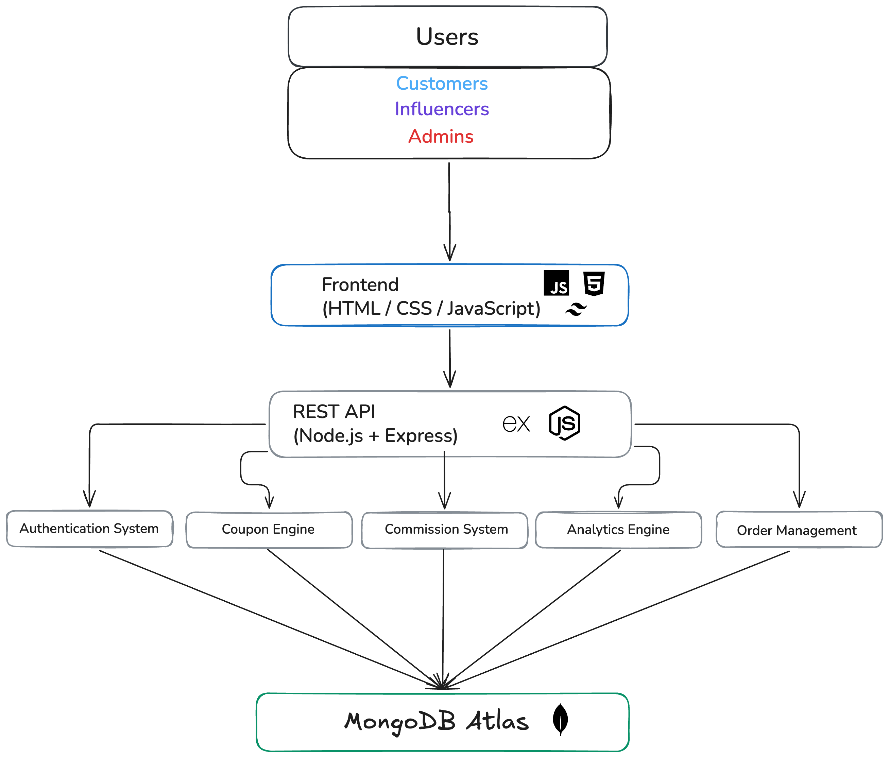
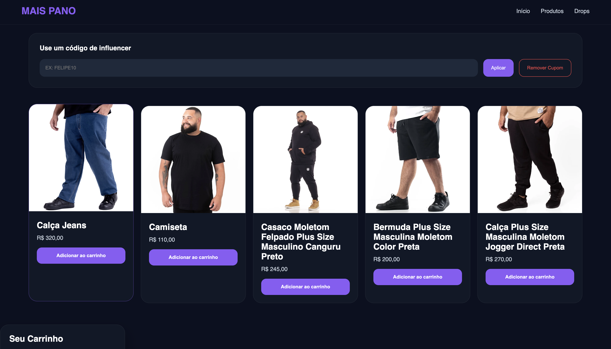
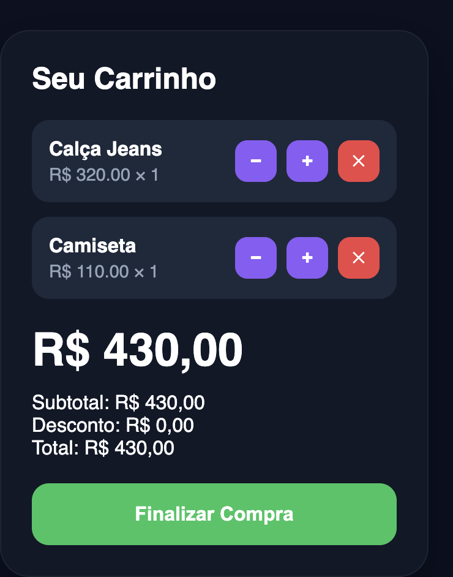
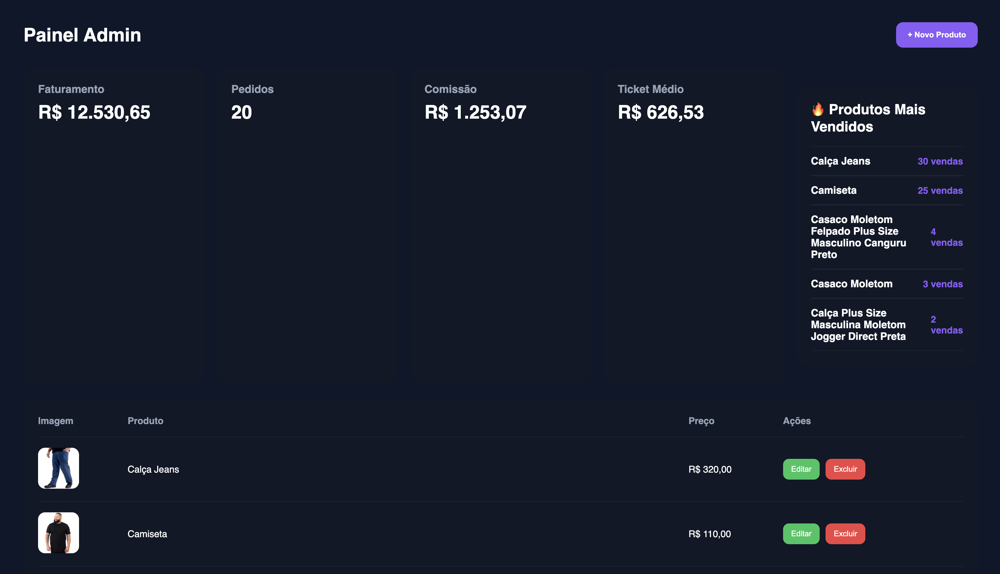
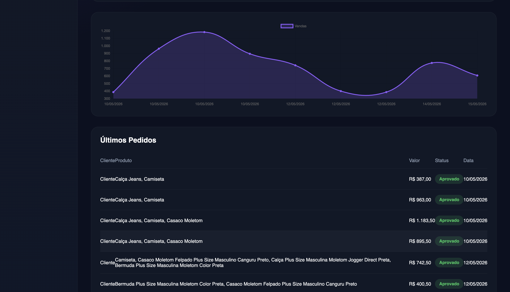

# MSPN Influencer Commerce Platform

Full-stack influencer-commerce platform developed for a real business, integrating ecommerce operations, influencer attribution systems, commission tracking, analytics dashboards, secure authentication, and cloud deployment infrastructure.

---

## Overview

MSPN Influencer Commerce Platform is a full-stack web application created to centralize ecommerce management and influencer partnerships for a real family business.

The platform was designed to solve operational problems involving:

- Influencer coupon attribution
- Commission tracking
- Order persistence
- Ecommerce workflows
- Sales analytics
- Administrative product management

The system combines a complete ecommerce workflow with an influencer performance infrastructure, allowing sales attribution, commission monitoring, analytics aggregation, and operational management through a centralized dashboard.

---

## Demo

  

---

## Live Deployment

### Frontend
https://influencers-mspn.vercel.app/

### Backend API
https://influencersmspn.onrender.com

---

## Tech Stack

### Frontend
- HTML
- CSS
- JavaScript

### Backend
- Node.js
- Express.js
- REST API Architecture

### Database
- MongoDB Atlas
- Mongoose ODM

### Authentication & Security
- JWT Authentication
- bcrypt Password Hashing
- Protected Middleware Routes
- Request Validation with Zod

### Media & Upload Infrastructure
- Multer
- Cloudinary

### Deployment
- Vercel
- Render

---

## Core Features

## Ecommerce System
- Product listing system
- Persistent shopping cart
- Dynamic quantity management
- Coupon-based checkout
- Persistent order processing
- Order history tracking

## Influencer Platform
- Unique influencer coupon codes
- Automated commission attribution
- Influencer revenue tracking
- Sales ranking system
- Commission calculation engine
- Performance monitoring

## Analytics Dashboard
- Revenue analytics
- Order statistics
- Conversion tracking
- Ticket average calculation
- Influencer rankings
- Product performance analytics
- Interactive charts and metrics

## Authentication System
- JWT-based authentication
- Stateless session management
- Password encryption with bcrypt
- Middleware authorization
- Protected admin routes
- Request validation layer

## Admin Infrastructure
- Product CRUD operations
- Product image upload system
- Analytics aggregation
- Sales monitoring
- Administrative dashboards

---

## Backend Architecture

- RESTful API structure
- Middleware-based authentication
- MongoDB document modeling
- JWT session management
- Event tracking architecture
- Analytics aggregation services
- Cloud image upload pipeline

---

## System Architecture

  

The platform uses a modular full-stack architecture integrating ecommerce workflows, influencer attribution, analytics aggregation, JWT authentication, MongoDB persistence, and cloud deployment infrastructure through a REST API backend.

---

## Engineering Challenges

### Influencer Attribution Logic
Designed a commission attribution system capable of associating purchases with influencer coupon codes while preventing duplicated commission events and maintaining analytics consistency.

### Persistent Shopping Cart
Implemented persistent cart synchronization between frontend state and backend database records across sessions and page refreshes.

### Analytics Aggregation
Developed backend aggregation logic responsible for dynamically calculating:
- Revenue
- Ticket averages
- Conversion rates
- Product rankings
- Influencer performance metrics

### Authentication & Authorization
Implemented stateless JWT authentication with middleware-based route protection and role-based authorization for admin operations.

### Media Upload Infrastructure
Built an image upload pipeline integrating Multer memory storage with Cloudinary cloud hosting for product management.

### Frontend & Backend Synchronization
Handled synchronization between ecommerce interactions, analytics tracking, order persistence, and dashboard updates.

---

## Security & Validation

- JWT stateless authentication
- Password hashing with bcrypt
- Protected middleware routes
- Request validation with Zod
- Admin authorization layer
- Secure environment variable management
- Protected API endpoints

---

## Scalability Considerations

The platform was designed using stateless REST APIs and cloud-hosted MongoDB infrastructure, allowing independent frontend/backend deployment and scalable backend architecture.

The modular backend structure also enables future integration of:
- Payment gateways
- Real-time analytics
- Email notification systems
- Advanced reporting systems
- Automated commission payouts
- Fraud prevention systems

---

## Screenshots

---

## Ecommerce Interface

  
  
  

The ecommerce interface includes persistent shopping cart functionality, dynamic quantity management, coupon application, and order processing workflows integrated with backend persistence.

---

## Influencer Dashboard & Analytics

  
  

  
  

The analytics dashboard provides commission tracking, influencer rankings, revenue monitoring, conversion analytics, product performance metrics, and aggregated business insights.

---

## Authentication System

  
  

Authentication is implemented using JWT-based stateless authorization, bcrypt password hashing, middleware route protection, and request validation with Zod.

---

## Future Improvements

- Stripe payment integration
- Real-time analytics with Socket.IO
- Automated email notifications
- Advanced analytics dashboards
- Multi-role administrative system
- Automated commission payouts
- Refresh token authentication
- Fraud prevention mechanisms

---

## What I Learned

Through this project, I gained practical experience in:

- Full-stack web development
- Backend architecture design
- REST API engineering
- Authentication systems
- Middleware patterns
- MongoDB schema modeling
- Analytics aggregation
- Cloud deployment infrastructure
- Secure session management
- File upload pipelines
- Business-oriented software development
- Ecommerce workflow engineering

---

## Motivation

This platform was developed to solve real operational challenges for a family business by improving influencer sales attribution, commission management, ecommerce organization, and analytics visibility through a scalable full-stack infrastructure.

---

## Author

Felipe Teixeira Masiero

GitHub:
https://github.com/felipetmasiero-ux
