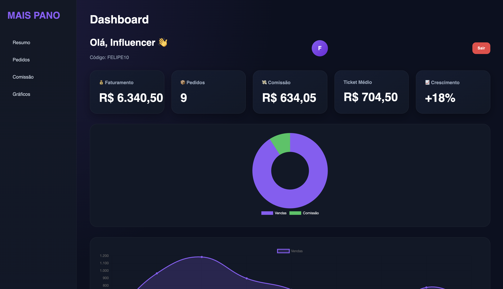
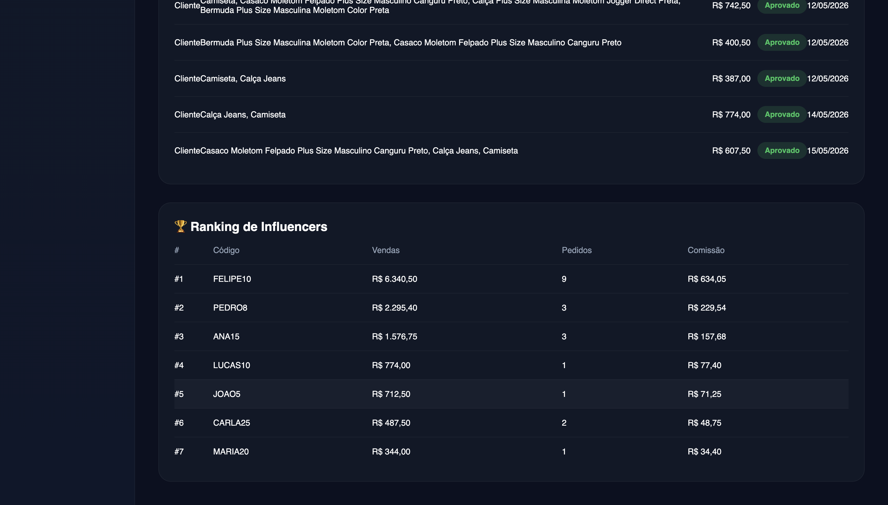
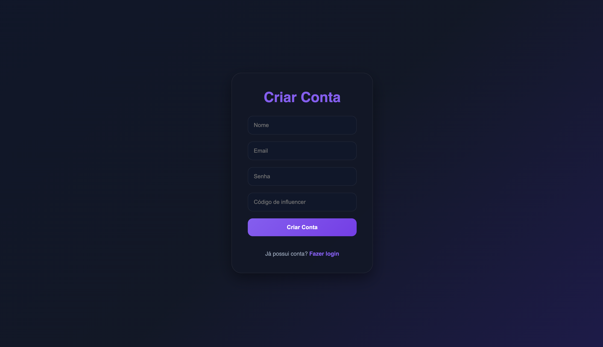

# 🚀 MSPN Influencer Commerce Platform

## 📌 Project Background

This project was built for a real business operated by my father.

The company works with influencer-based sales, but everything was being tracked manually through spreadsheets and messages, which made it difficult to know:
- which influencer generated each sale;
- how much commission each person should receive;
- and how the campaigns were performing overall.

To solve this, I developed a full-stack platform that automates the entire coupon and commission workflow.

---

## 🎯 Main Goal

The main objective was to create a system where:

- each influencer has their own coupon code;
- sales are automatically attributed;
- commissions are calculated without manual work;
- and the business can monitor performance through dashboards and analytics.

---

## 💡 What I Built

The platform includes:

- Ecommerce frontend for customer purchases
- Influencer coupon system
- Automatic commission calculation
- Analytics dashboard
- Authentication system
- REST API connected to MongoDB Atlas
- Cloud deployment using Vercel and Render

---

## 🛠️ Tech Stack

### Frontend
- React
- Vite
- TailwindCSS

### Backend
- Node.js
- Express.js
- JWT Authentication
- bcrypt

### Database
- MongoDB Atlas

### Deployment
- Vercel
- Render

---

## 🏗️ System Architecture

```txt
Customer
  → Ecommerce Frontend
      → REST API (Node.js + Express)
          → Coupon & Commission Logic
              → MongoDB Atlas
                  → Analytics Dashboard
```

## ⚠️ Challenges

One of the biggest challenges was making sure coupon attribution remained consistent during the checkout flow.

I also had to prevent duplicated commissions and invalid coupon usage while keeping the logic simple enough to maintain.

Another important part was connecting the frontend, backend, authentication, and database into a workflow that behaved like a real production application instead of just a demo project.

---

## 🌐 Live Deployments

- Frontend: https://influencers-mspn.vercel.app
- Backend API: https://influencersmspn.onrender.com

---

## 🖼️ Screenshots

### Ecommerce

<p align="center">
  
  
  
</p>

---

### Influencer Dashboard

<p align="center">
  
</p>

---

### Analytics

<p align="center">
  
  
  
</p>

---

### Authentication

<p align="center">
  
  
</p>

---

## 🧠 What I Learned

Through this project I improved my understanding of:

- Full-stack application architecture
- REST API development
- Authentication and authorization using JWT
- MongoDB data modeling
- Ecommerce state management
- Business logic implementation
- Deployment workflows
- Integration between frontend and backend services

---

## 📌 Final Notes

This project was especially important to me because it was built around a real business problem instead of a tutorial scenario.

Working on something that would actually be used helped me think more carefully about usability, reliability, and maintainability.

This experience showed me how software can solve practical business problems and motivated me to keep building technology with real-world impact.
